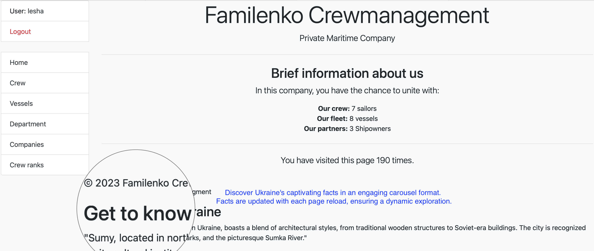
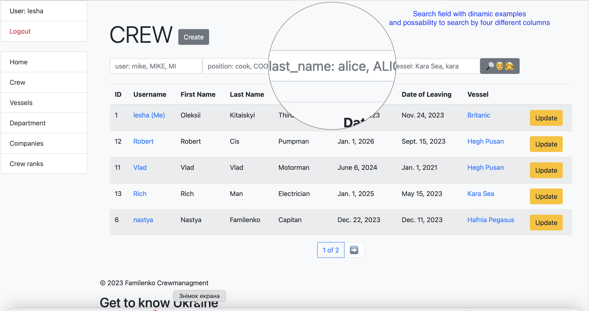
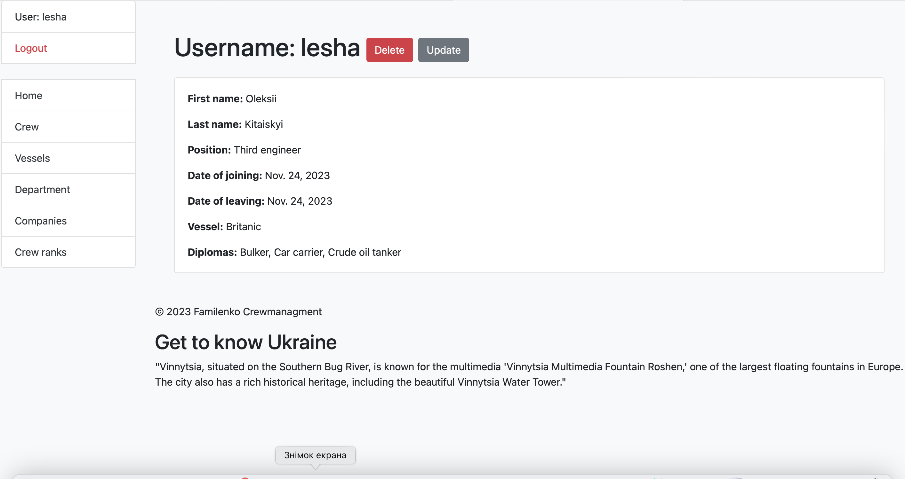
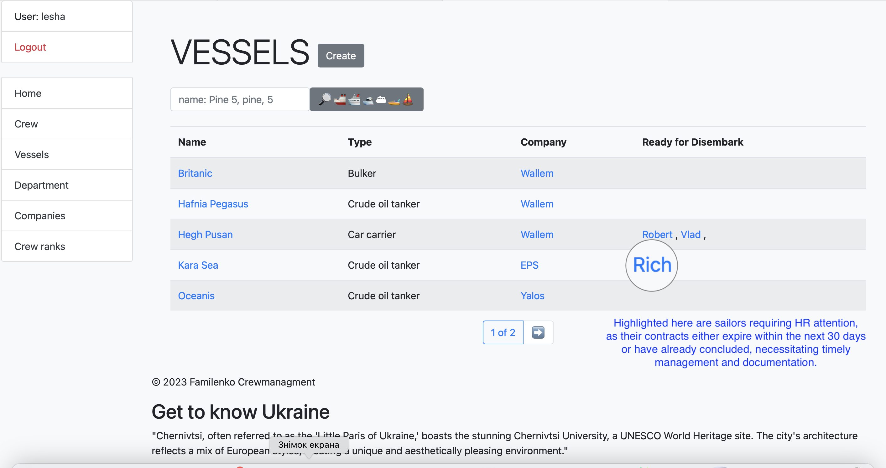
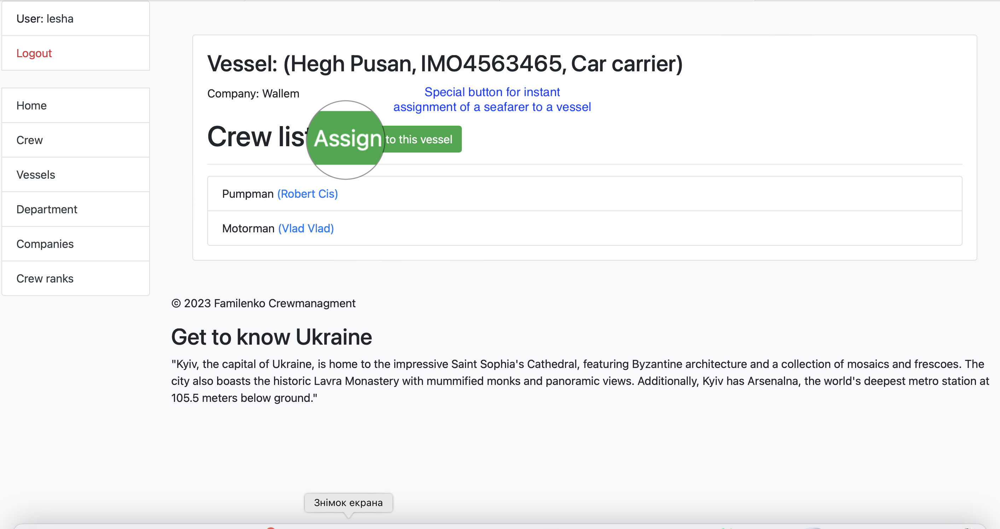
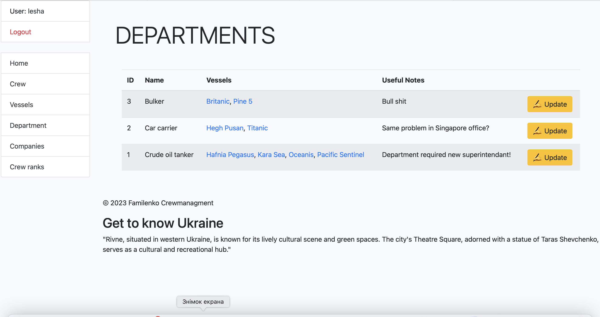
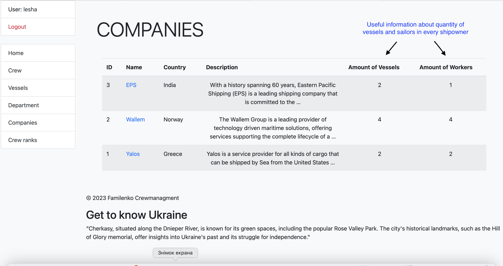
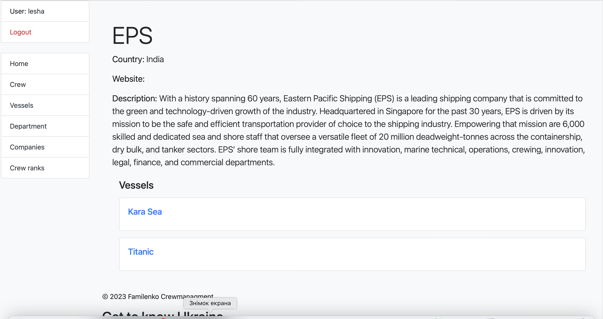
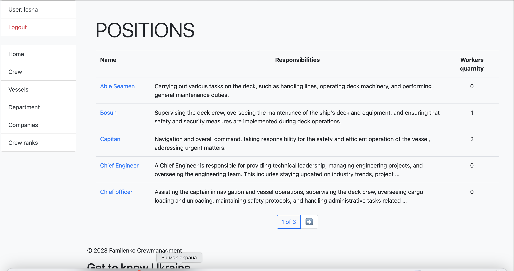
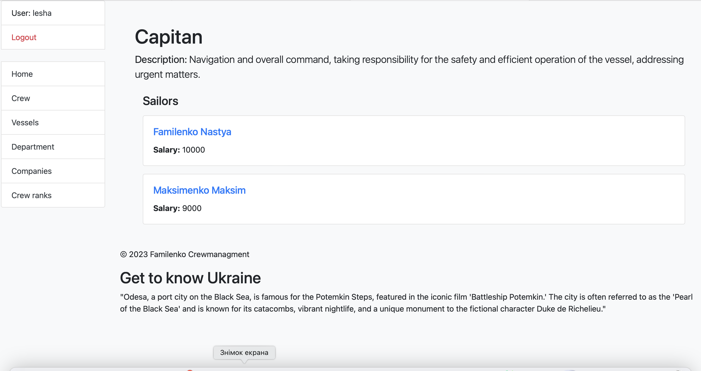

# Сrewing company site

## Description
This is a site for a crewing company.
It allows you to store information about ships, crew members, their contracts, 
manage sailors and their contracts.

## Link to the site
https://creqing-company-site.onrender.com/

## Installation

### Set up the environment
    ```
    python -m venv venv
    venv\Scripts\activate (on Windows)
    source venv/bin/activate (on macOS)
    ```

### Set up requirements
- Python 3.11

    ```
    pip install -r requirements.txt
    ```

### Set up database

- Use the following command to load prepared data from fixture to test and debug this code:

`python manage.py migrate`
  
`python manage.py loaddata crewing_db_data.json`

- After loading data from fixture you can use following superuser (or create another one by yourself):
  - Login: `lesha`
  - Password: `Gugaga9898`

### Run the server

- Use the following command to run the server:
- `python manage.py runserver`

# Site description

## Main page

Ona the main page you can see the list of all ships and their crew members.

And additionally you may discover on all pages Ukraine's captivating facts in an engaging carousel format.
Facts are updated with each page reload, ensuring a dynamic exploration.



## Crew

On this page you can see the list of all crew members and their contracts.
Sailors and vessels are clickable and lead to the corresponding pages.
There is possibility to update and delete sailors and their contracts, date of readiness.

Search field with dinamic examples
and possability to search by four different columns





## Vessel

This page shows the list of all vessels and sailors 
which is currently on board in detailed view.

Highlighted here are sailors requiring HR attention, 
as their contracts either expire within the next 30 days 
or have already concluded, necessitating timely management 
and documentation.

Vessels, company and sailors are clickable and lead to the corresponding pages.



### Detailed page list all particular information and have special buttons


## Department

This page shows the list of all departments and vessels related to them.
Here it is comfortable to leave useful notes and tasks for each department.



## Company

This page shows the list of all companies and 
vessels related to them in detailed view.




## Crew rank

This page shows the list of all crew ranks and 
sailors related to them in detailed view.




